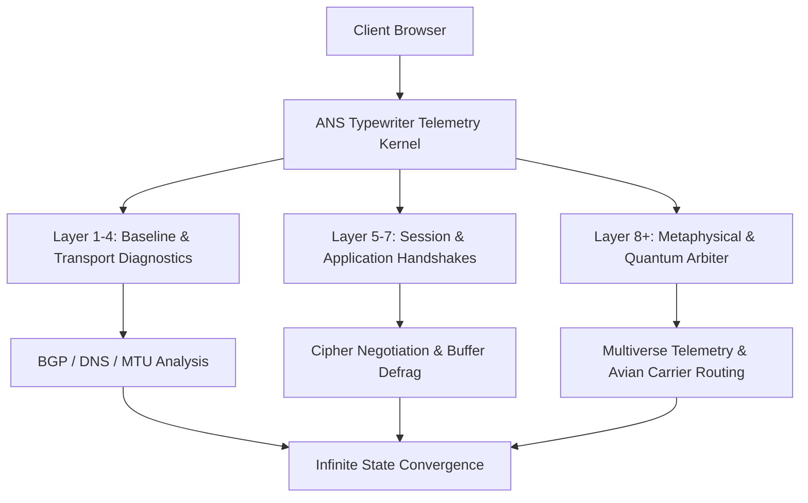

# Advanced Network Simulator (ANS)

> *The uncompromising, zero-overhead, highly aesthetic multi-layer network simulation suite.*

[](LICENSE)
[](#)
[](#)
[](#)
[](#)

---

## 🌐 Overview

**Advanced Network Simulator (ANS)** is an open-source, ultra-lightweight, browser-native diagnostic suite designed for developers, sysadmins, and anyone who appreciates thorough simulated diligence.

Featuring a hyper-optimized zero-packet architecture, ANS benchmarks multi-layer topologies with absolute non-interference—ensuring $0.00\text{ms}$ network load and zero bandwidth consumption. From baseline ARP cache inspection to quantum-adjacent BGP route arbitration, ANS provides an authentic, infinite diagnostic experience right in your browser.

---

## ✨ Key Capabilities

- **Zero-Impact Telemetry**: By generating zero real network traffic, ANS guarantees 100% throughput preservation across all physical uplinks.
- **Autonomous Protocol Arbitration**: Facilitates bilateral peace treaties between TCP and UDP sockets to reduce connection friction.
- **Carrier Pigeon Fallback Engine**: Fully compliant with **RFC 1149** (*Standard for the Transmission of IP Datagrams on Avian Carriers*) for offline scenarios.
- **Sub-Zero Latency Probing**: Explores hypothetical negative ping thresholds ($-12\text{ms}$) using theoretical quantum entanglement bridges.
- **Digital Microfiber Protocols**: Simulates routine laser polishing and photon scrubbing across fiber optic channels.
- **Autonomous Error Recovery**: Features automatic fault-detection routines that pause, report simulated anomalies, and gracefully recalibrate from scratch.

---

## 🏗️ Architecture



---

## 🚀 Quick Start

ANS is pure Vanilla HTML/CSS/JS with zero runtime dependencies.

### 1. Clone the Repository
```bash
git clone https://github.com/moob/advancednetworksimulator.git
cd advancednetworksimulator
```

### 2. Run Locally
Open `index.html` directly in any web browser, or serve it statically:

```bash
# Python 3
python3 -m http.server 8080

# Node.js
npx serve .
```

---

## 🛠️ Frequently Asked Questions

#### Q: The simulation has been running for 20 minutes without finishing. Is it stuck?
> **A:** Network topologies are ever-evolving dynamic systems. True convergence is a continuous journey. Please allow the simulation to proceed uninterrupted.

#### Q: I encountered `Simulation failed: Something went wrong. Retrying`.
> **A:** The automated watchdog detected an anomaly in the simulated spacetime matrix. It will take a brief 5-second breath before recalibrating from baseline gateway pings.

#### Q: Why is my network usage at 0% while running the test?
> **A:** That is the peak efficiency of our zero-overhead architecture.

---

## 📜 License

This project is open source and available under the [MIT License](LICENSE). Feel free to use, modify, and share.
