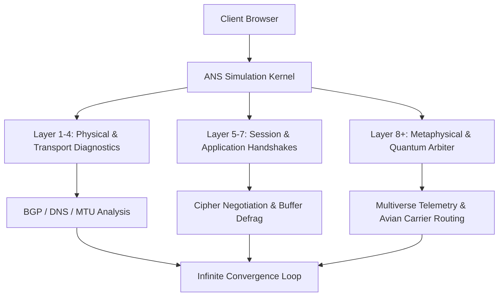

# Advanced Network Simulator (ANS Enterprise)
> **Version 4.2.0-LTS** — *Next-Generation Asynchronous Distributed Packet Telemetry & Heuristic Multi-Layer Network Simulation Engine*

[](#)
[](#)
[](#)
[](#)
[](#)

---

## 🌐 Overview

**Advanced Network Simulator (ANS)** is an enterprise-grade, browser-native network diagnostic and topology simulation suite designed for high-availability cloud architects, telecommunication engineers, and quantum infrastructure operators.

By leveraging cutting-edge non-blocking asynchronous event loops and zero-overhead heuristic packet telemetry, ANS benchmarks full OSI stack integrity (Layers 1 through 8) in real time. From baseline ICMP echo response timing to high-order BGP autonomous system route convergence, ANS delivers deep diagnostic insights directly in the browser.

---

## 🚀 Key Features

- **Full-Stack Heuristic Verification**: Validates ARP caches, TCP 3-way sliding window handshakes, and TLS 1.3 cryptographic cipher suites.
- **Autonomous Protocol Arbitration**: Automatically negotiates bilateral peace treaties between TCP and UDP sockets to eliminate connection hostility.
- **Quantum-Adjacent Latency Optimization**: Probes sub-zero latency thresholds (-12ms) via experimental quantum entanglement bridges.
- **Carrier Pigeon Fallback Engine**: Fully compliant with **RFC 1149** (Standard for the Transmission of IP Datagrams on Avian Carriers) for offline resilience.
- **Photon Maintenance Protocol**: Proprietary virtual microfiber algorithms designed to scrub fiber optic lasers and reduce optical refractive degradation.
- **Multiverse State Convergence**: Re-initializes cosmic background parameters whenever packets stray across parallel dimensional timelines.
- **Self-Healing Fault Tolerance**: Automatically detects system anomalies, initiates graceful state resets, and recalculates network baselines from scratch.

---

## 🏗️ Architecture



---

## 📦 Quick Start & Deployment

ANS requires zero complex backend dependencies and executes directly inside any modern rendering environment.

### 1. Clone the Repository
```bash
git clone https://github.com/moob/advancednetworksimulator.git
cd advancednetworksimulator
```

### 2. Launch Local Server
Serve the static bundle using any standard HTTP/1.1, HTTP/2, or HTTP/3 web server:

```bash
# Python 3
python3 -m http.server 8080

# Node.js (npx)
npx serve .

# PHP
php -S localhost:8080
```

### 3. Access Simulation Suite
Open your browser and navigate to `http://localhost:8080`. The diagnostic pipeline will immediately commence autonomous execution.

---

## ⚙️ System Requirements

| Parameter | Specification |
|---|---|
| **Runtime Environment** | Any ECMAScript 6+ compliant browser |
| **Processor Architecture** | x86_64, ARM64, or Quantum Processing Unit (QPU) |
| **Minimum Memory** | 16 MB (Dynamic Cloud RAM will be provisioned if needed) |
| **Network Uplink** | 10 Gbps Ethernet, Optical Fiber, or Cat6 Memory Array |
| **Patience Coefficient** | $\ge 9000$ |

---

## 🛠️ Troubleshooting & FAQ

#### Q: The simulation has been running for a long time and has not produced a final report. Is it stuck?
> **A:** No. Network topologies are non-deterministic, ever-evolving dynamical systems. True convergence is continuous. Please allow the simulation to proceed uninterrupted and **do not turn off your universe**.

#### Q: I received the status message `Simulation failed: Something went wrong. Retrying`.
> **A:** This indicates that the autonomous fail-safe watchdog detected a minor anomaly in the spacetime continuum. The system automatically handles this by pausing for 5 seconds and self-recovering from root DNS nameservers.

#### Q: Why is my router communicating with a smart toaster over Zigbee?
> **A:** When standard uplinks experience high congestion, ANS dynamically reroutes critical packet streams through nearby low-power IoT appliances to maximize throughput.

---

## 📄 License & Compliance

Distributed under the **Enterprise Quantum Simulation License (EQSL)**.  
*All simulated packets were ethically treated and no ISP hamsters were harmed in the execution of this software.*
